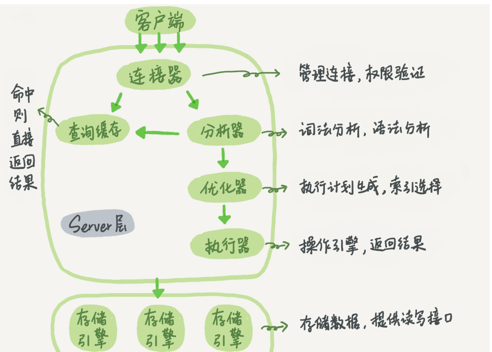

#### 一条语句的执行流程

  
 
在执行语句的时候，首先要连接数据库，这是连接器的工作。

当我们在一个表上有更新操作时，和这个表有关的查询缓存会失效，所以就会把表中所有缓存结果都清空。

接下来，分析器通过词法和语法分析知道这是一条更新语句，优化器决定是由那个索引，执行器负责具体执行。

#### 两个重要的日志模块：redo log和binlog

##### redo log

redo log是存在于InnoDB引擎中，··

1. redo log的概念是什么? 为什么会存在.
   2. 什么是WAL(write-ahead log)机制, 好处是什么.
   3. redo log 为什么可以保证crash safe机制.
   4. binlog的概念是什么, 起到什么作用, 可以做crash safe吗? 
   5. binlog和redolog的不同点有哪些? 
   6. 物理一致性和逻辑一直性各应该怎么理解? 
   7. 执行器和innoDB在执行update语句时候的流程是什么样的?
   8. 如果数据库误操作, 如何执行数据恢复?
   9. 什么是两阶段提交, 为什么需要两阶段提交, 两阶段提交怎么保证数据库中两份日志间的逻辑一致性(什么叫逻辑一致性)?
  10. 如果不是两阶段提交, 先写redo log和先写bin log两种情况各会遇到什么问题? 

