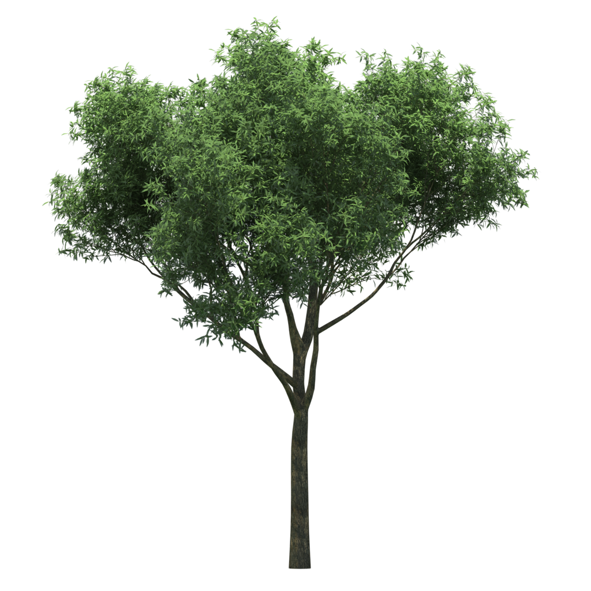
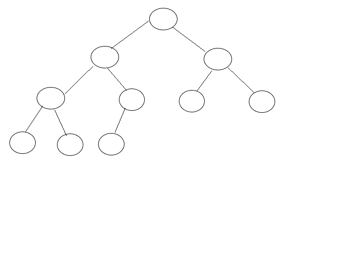
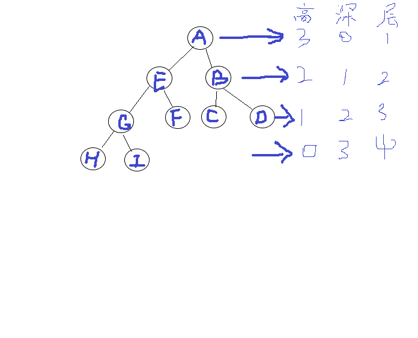
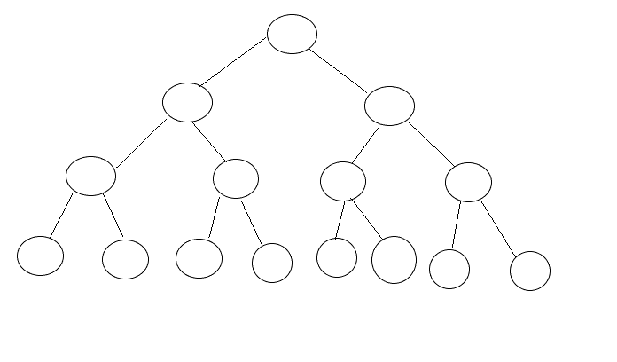
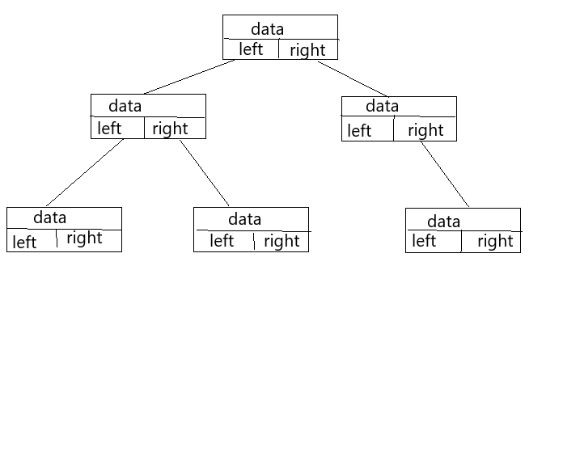
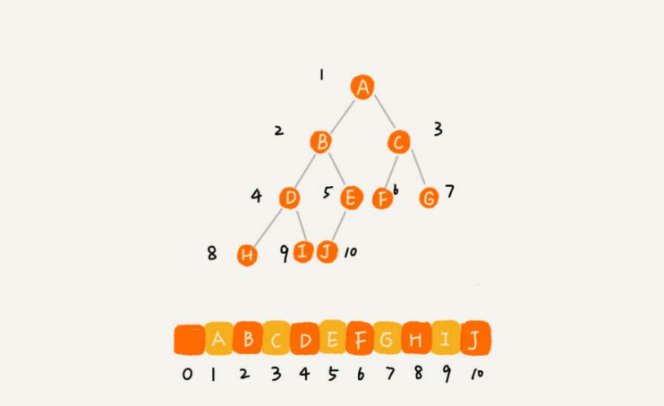
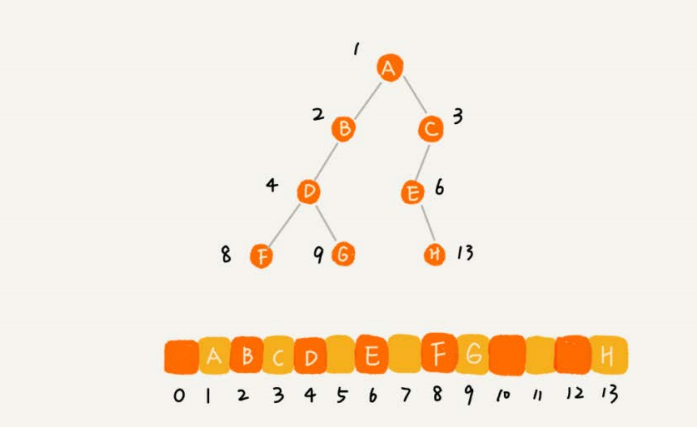
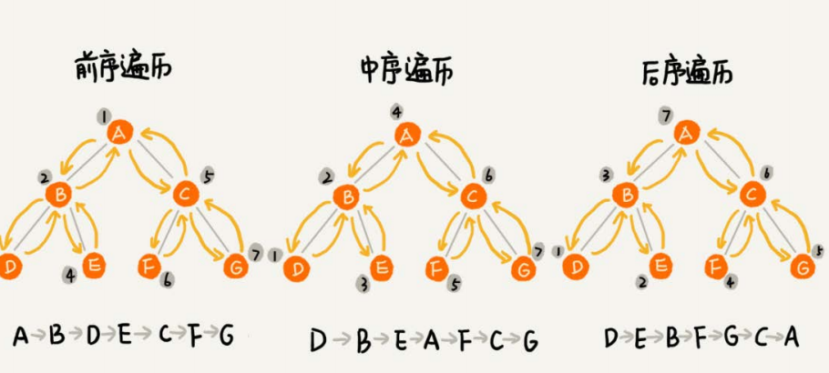

### 树

<div align="center"> 
    
</div>


理论来源于实践。在现实生活中，我们会见到树，在数据结构中的树，也是和它是相似的。在数据结构中树就像将一棵现实中的树倒立,它的根向上，叶子向下。

<div align="center"> 
    
</div>

#### 在树中的一些基本概念

树中中节点的关系像我们人类的关系网一样。若一个结点有子树，那么该结点称为子树根的**"双亲"**，子树的根是该结点的**"孩子"**。有相同双亲的结点互为"**兄弟"**。一个结点的所有子树上的任何结点都是该结点的后裔。从根结点到某个结点的路径上的所有结点都是该结点的祖先。
**叶子节点**：没有子节点的节点。

**节点的高度(Height):**节点到叶子节点的最长路径(边数)。

**节点的深度(Depth)**:根节点到这个节点所经历的边数的个数。

**节点的层数：**节点深度+1。

**树的高度：**根节点的高度。

下面就使用一个例子来讲解上面提到的概念

<div align="center"> 
    
</div>

 

A节点为E和B的**父亲节点**，A节点没有父亲节点，所以A节点为**根节点**。E和B在同一层上，所以为**兄弟节点**。H、I、C、D没有子节点，所以为**叶子节点**。

**节点高度**类似与我们所说的楼高，是从叶子节点像上依次递增，节点深度类似与我们说水的深度，从上到下依次递增的。

### 二叉树

树的结构是多种多样的，但是我们最常用的是二叉树。

#### 概念

二叉树即为每个节点最多有两个子节点，分别为左子节点和右子节点。

#### 满二叉树和完全二叉树

**满二叉树**为叶子节点全在最底层，且除了叶子节点外，其他节点均拥有左右子树。

<div align="center"> 
    
</div>

**完全二叉树**为叶子节点全在最底层且叶子节点都为左边。

<div align="center"> 
    
</div>

#### 二叉树的存储

###### 链式存储法

<div align="center"> 
    
</div>

类似与链表的储存法，每一个节点由数据区以及指向左右子节点的指针。

##### 基于数组的顺序存储法

假如要通过数组来储存树。如图是一棵完全二叉树

<div align="center"> 
    
</div>


根节点储存在下标为1的位置，可以看出储存的规律为左子树储存在2*i的位置。右子树存储在2 * i +1的位置。数组为连续存储空间，这样就不会造成空间的浪费。

假如当为一颗普通的二叉树的时候，储存如图所示

<div align="center"> 
    
</div>

通过图可以看出如果是普通的二叉树就会不可以充分的利用数组的空间，造成空间的浪费。

#### 二叉树的遍历(最后有代码实现)

##### 二叉树的遍历方式有两种：广度优先遍历(BFS)和深度优先遍历(DFS)

###### 遍历方式：深度优先遍历

深度优先遍历在二叉树中，分为三种情况

前序遍历、中序遍历、后续遍历

前序遍历：根节点->左子树->右子树

**递归实现**

```java
  private void preOrder(Node node){
        if(node == null){
            return;
        }
        System.out.print(node.e+"\t");
        preOrder(node.left);
        preOrder(node.right);
    }
```

中序遍历：左子树->根节点->右子树

```java
  private void preOrder(Node node){
        if(node == null){
            return;
        }
        preOrder(node.left);
      System.out.print(node.e+"\t");
        preOrder(node.right);
    }
```

后序遍历：左子树->右子树->根节点

```java

private void preOrder(Node node){
        if(node == null){
            return;
        }
        preOrder(node.left);
           preOrder(node.right);
      System.out.print(node.e+"\t");
     }
```


<div align="center"> 
    
</div>

###### 递归实现深度优先遍历

**遍历方式：深度优先遍历**

广度优先遍历又称层序遍历。将二叉树按层进行遍历。

**代码实现**

```java
 public void levelOrder(){
        Queue<Node> q= new LinkedList<>();
        q.add(root);
       while(!q.isEmpty()){
           Node cur= q.remove();
           System.out.println(cur.e);
           if(cur.left!=null)
           {
               q.add(cur.left);
           }
            if(cur.right!=null) {
               q.add(cur.right);
           }
       }
    }
```


#### 二分搜索树

二分搜索树是一种特殊的二叉树，定义是任何节点的左节点小于该节点的值，右节点大于该节点的值。

下面就用代码实现二分查找树

**二分搜索树的节点类**

```java
 private class Node{
      public  E e;
    public    Node left,right;
    public Node(E e) {
        this.e = e;
        left = null;
        right = null;
    }
```

**常量以及构造方法**

```java
 private  Node root;//根节点
    private int size;//树中存储元素的个数
public BST(){
        root = null;
        size=0;

    }
```

**查找是否存在该某一元素**

```java
   public boolean contains(E e){
        return  contains(root,e);

    }
    //以node为根的二分搜索树是否包含元素e
    private boolean contains(Node node,E e)
    {   //如果该节点为空，直接返回false，递归的终止条件
        if( node == null){
            return false;
        }
        //传入的元素和该节点的值相同，返回true
        if(e.compareTo(node.e)==0)
        {
            return true;
        }
        //传入的值小于该节点的值，向左子树继续搜索
        if(e.compareTo(node.e)<0) {
            return contains(node.left,e);
        } else {
            //否则向右子树搜索
            return contains(node.right,e);
        }
    }
```

**向二分搜索树中添加元素**

```java
public void add(E e){
          root =  add(root ,e);
}
//向以node为根的二分搜索树中添加元素e  ，递归算法
    //返回插入新节点后二分搜索树的根
private Node add(Node node,E e ) {
    if (node == null) {
        size++;
        return new Node(e);
    }
    if (e.compareTo(node.e) < 0) {
        node.left = add(node.left, e);
    } else if (e.compareTo(node.e) > 0) {
        node.right = add(node.right, e);
    }
    return node;
}
```

**二分搜索树的删除操作**

删除操作分为三种情况

1. 被删除的节点左右子树都为空，直接将该节点的值赋值为null即可。
2. 当被删除节点只有一个子节点的情况下，我们直接更新要删除节点父节点的指针让他指向被删除元素的子节点即可。
3. 当被删除节点有两个子节点的时候，找到被删除节点右子树中的最小节点，让他替换被删除的节点。

```java
    public void remove(E e)
    {
     root= remove(root,e);
    }
    private Node remove(Node node,E e){
        if(node==null)
        {
            return null;
        }
        //查找要删除的节点
        if(e.compareTo(node.e)<0)
        {
            node.left=remove(node.left,e);
            return node;
        }
        else if(e.compareTo(node.e)>0)
        {
            node.right=remove(node.right,e);
            return node;
        }
        else{
            //待删除的左子树为空的情况
            if(node.left==null)
            {
                Node rightNode=node.right;
                node.right=null;
                size--;
                return rightNode;
            }
            //待删除的右子树为空
            if(node.right==null)
            {
                Node leftnode=node.left;
                node.left=null;
                size--;
                return leftnode;
            }
//  待删除节点左右子树均不为null
//  找到比比待删除节点大的最小节点，及待删除节点右子树的最小节点
// 用这个节点顶替待删除的节点
         Node successor=minmum(node.right);
            successor.right=removeMin(node.right);
            successor.left=node.left;
            node.left=node.right=null;
            return successor;
        }
    }
```

#### 二分搜索树的总结

二分搜索树是特殊的二叉树。

1. 二分查找树的操作节点的时间复杂度为O(logn)

#### 该类的全部代码

```java
import java.util.LinkedList;
import java.util.Queue;
import java.util.Stack;

public class BST<E extends Comparable<E>> {
    private class Node{
      public  E e;
    public    Node left,right;
    public Node(E e) {
        this.e = e;
        left = null;
        right = null;
    }
    }
    private  Node root;
    private int size;
    public BST(){
        root = null;
        size=0;

    }
    public int size(){return size;}
public boolean isEmpty(){
        return size==0;
}
public void add(E e){
          root =  add(root ,e);

}
//向以node为根的二分搜索树中添加元素e  ，递归算法
    //返回插入新节点后二分搜索树的根
private Node add(Node node,E e ) {
    if (node == null) {
        size++;
        return new Node(e);
    }
    if (e.compareTo(node.e) < 0) {
        node.left = add(node.left, e);
    } else if (e.compareTo(node.e) > 0) {
        node.right = add(node.right, e);
    }
    return node;
}
//在二分搜索是否包含元素e
    public boolean contains(E e){
        return  contains(root,e);

    }
    //以node为根的二分搜索树是否包含元素e
    private boolean contains(Node node,E e)
    {
        if( node == null){
            return false;
        }
        if(e.compareTo(node.e)==0)
        {
            return true;
        }
        if(e.compareTo(node.e)<0) {
            return contains(node.left,e);
        } else {
            return contains(node.right,e);
        }
    }
    //二分搜索树的遍历
    //二分搜索树的前序遍历
    public void preOrder(){
        preOrder(root);
    }
    private void preOrder(Node node){
        if(node == null){
            return;
        }
        System.out.print(node.e+"\t");
        preOrder(node.left);
        preOrder(node.right);
    }
    //二分搜索树的中序遍历
    //
    public void inOrder(){
        inOrder(root);
    }
    private void inOrder(Node node){
        if(node == null){
            return;
        }

        inOrder(node.left);
        System.out.print(node.e+"\t");
        inOrder(node.right);
    }
    //二分搜索树的后序遍历
    public void outOrder(){
        outOrder(root);
    }
    private void outOrder(Node node){
        if(node == null){
            return ;
        }

        outOrder( node.left );
        outOrder( node.right );
        System.out.print(node.e+"\t");

    }
    //二分搜索树的前序遍历的非递归
    public void preOrderNR(){
         Stack<Node> stack = new Stack<Node>();
         stack.push(root);
         while(!stack.isEmpty()){
             Node cur=stack.pop();
                System.out.println(cur.e);
                if(cur.right!=null){
                    stack.push(cur.right);
                }
                if(cur.left!=null)
                {
                stack.push(cur.left);
                }
         }
    }
//二分搜索树的层序遍历
    public void levelOrder(){
        Queue<Node> q= new LinkedList<>();
        q.add(root);
       while(!q.isEmpty()){
           Node cur= q.remove();
           System.out.println(cur.e);
           if(cur.left!=null)
           {
               q.add(cur.left);
           }
            if(cur.right!=null) {
               q.add(cur.right);
           }
       }
    }
    //删除二分搜索树中的最小值和最大值
        //
    public E minmum(){
        if(size==0)
        {
            throw new IllegalArgumentException("Bst is empty");
        }
        return minmum(root).e;
    }
    private  Node minmum(Node node){
        if(node.left==null){
            return node;
        }
        return minmum(node.left);
    }
    public E maxmum(){
        if(size==0)
        {
            throw new IllegalArgumentException("Bst is empty");
        }
        return maxmum(root).e;
    }
    private  Node maxmum(Node node){
        if(node.left==null){
            return node;
        }
        return maxmum(node.right);
    }
    //从二分搜索树中删除最小值所在的节点，返回最小值

    public E removeMin(){
    E ret  = minmum();
    root=removeMin(root);
    return ret;
    }
    private Node removeMin(Node node){
        if(node.left==null){
            Node rightNode=node.right;
            node.right=null;
            size--;
            return rightNode;
        }
        node.left=removeMin(node.left);
        return node;
    }

    //从二分搜索树中删除最大值所在的节点，返回最大值

    public E removeMax(){
        E ret  = maxmum();
        root=removeMax(root);
        return ret;
    }
    private Node removeMax(Node node){
        if(node.right==null){
            Node leftNode=node.left;
            node.left=null;
            size--;
            return leftNode;
        }
        node.right=removeMax(node.right);
        return node;
    }
    //
    public void remove(E e)
    {
     root= remove(root,e);
    }
    private Node remove(Node node,E e){
        if(node==null)
        {
            return null;
        }
        if(e.compareTo(node.e)<0)
        {
            node.left=remove(node.left,e);
            return node;
        }
        else if(e.compareTo(node.e)>0)
        {
            node.right=remove(node.right,e);
            return node;
        }
        else{
            //待删除的左子树为空的情况
            if(node.left==null)
            {
                Node rightNode=node.right;
                node.right=null;
                size--;
                return rightNode;
            }
            //待删除的右子树为空
            if(node.right==null)
            {
                Node leftnode=node.left;
                node.left=null;
                size--;
                return leftnode;
            }
//  待删除节点左右子树均不为null
//  找到比比待删除节点大的最小节点，及待删除节点右子树的最小节点
// 用这个节点顶替待删除的节点
         Node successor=minmum(node.right);
            successor.right=removeMin(node.right);
            successor.left=node.left;
            node.left=node.right=null;
            return successor;
        }
    }
}


```

