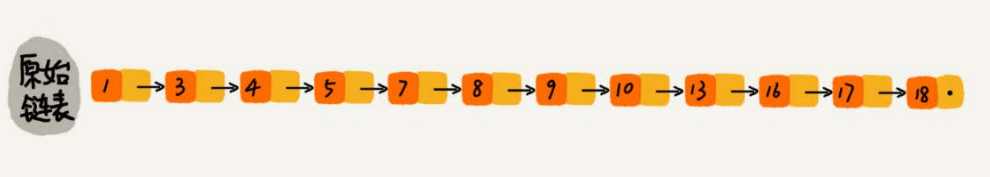
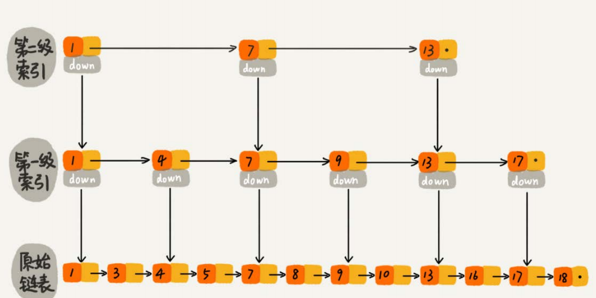

#### 跳表的原理

我们在二分查找中说到，二分查找有一定的局限性，数组的随机访问是二分查找的关键。如果我们想在链表中，也使用类似二分查找的算法。我们把改造之后的数据结构叫做跳表。

链表之所以不适合于二分查找，是因为它访问元素时，都需要对链表进行遍历，时间复杂度高，为了提高效率，我们可以在链表的每一个节点中添加索引。

    

设置索引的目的是让我们在查找数据的时候，尽可能的少遍历节点，从而降低时间复杂度，所以我们需要建立多级索引来，达到降低时间复杂度的效果(如图)。

    

当我们需要将查找的元素为索引为10的时候，我们只需要在第二场索引查找到索引为7的位置，然后下降到第二级索引向后遍历一个元素到索引为9的位置，然后下降到原始链表之中，向后遍历以一个元素，从而找到目标元素。

我们对比一下，建立索引以后 ，带来的时间复杂度的优化。在原始的链表中，我们要查找到10个节点，需要遍历十个元素，当建立索引以后，只需要遍历6个节点就可以了。

当数据量很大的时候，就可以体现出跳表的优势。

#### 跳表的复杂度分析

