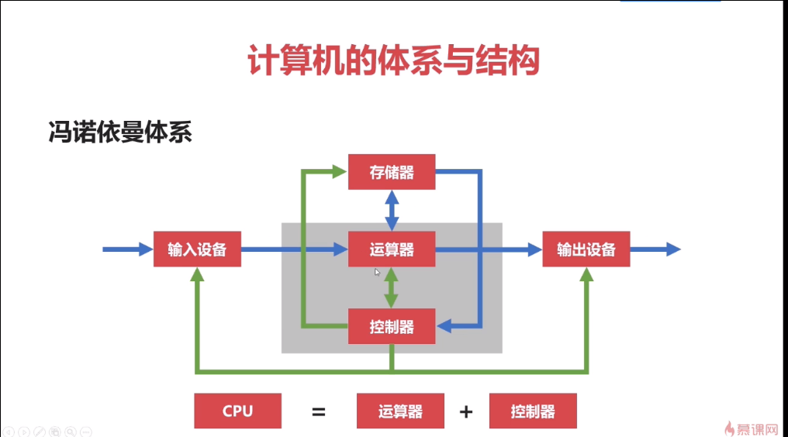
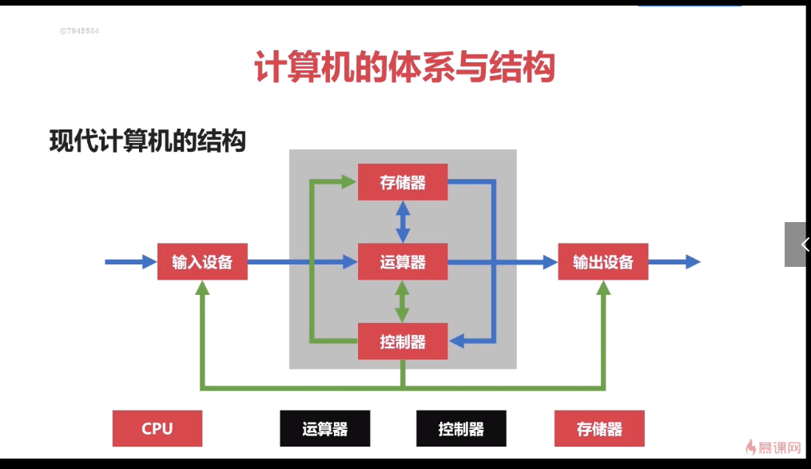
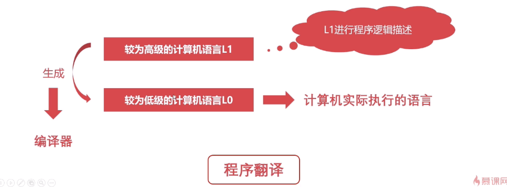
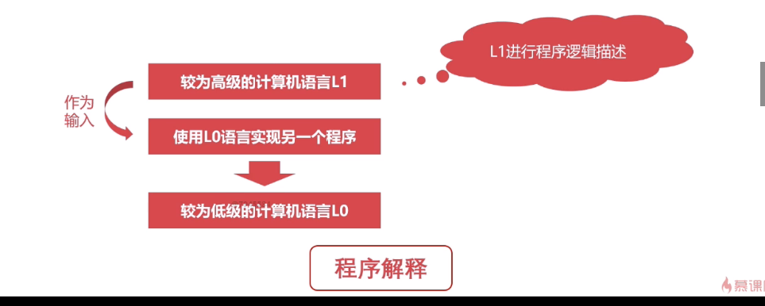
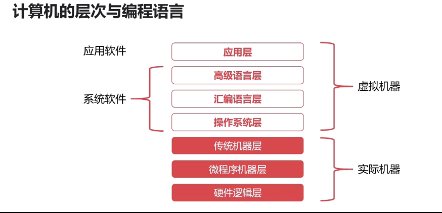
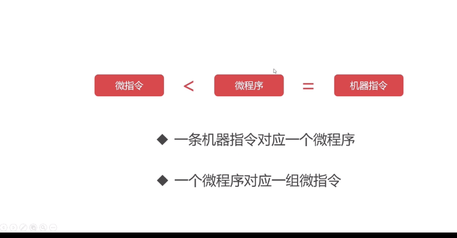
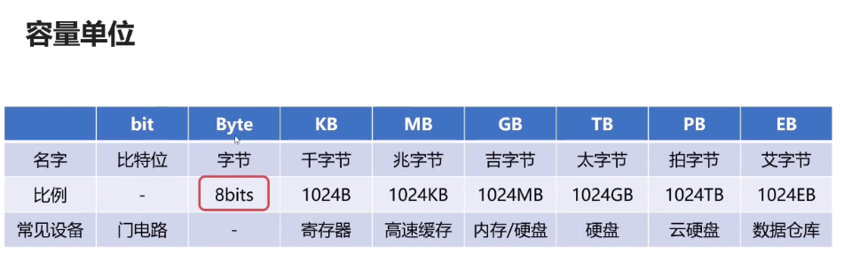
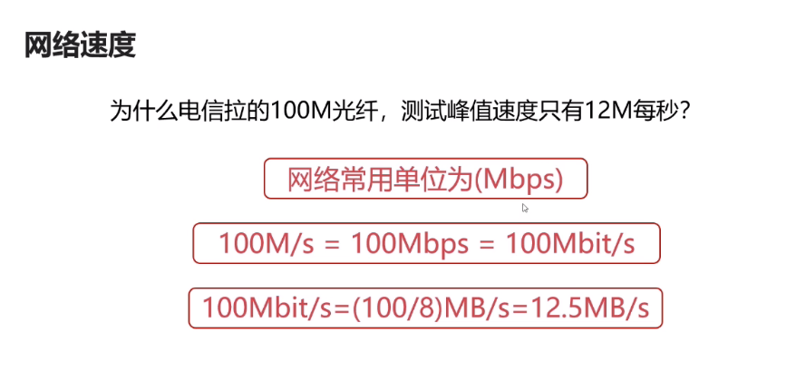

## 计算机的发展简史

#### 计算机发展的年代史

**1946~1957年，电子管计算机**

**1957~1964年，晶体管计算机**

**1964~1980年，集成电路计算机**

**1980年以后，超大规模集成电路计算机**

#### 计算机的分类

**超级计算机**

**大型计算机**

**迷你计算机(服务器)**

**工作站**

**微型计算机** 

### 计算机的体系与结构

#### 冯诺依曼体系

 将程序指令和数据一起储存的计算机设计概念结构

早期的计算机仅含有固定用途的程序--->改变程序得更改结构、重新设计电路--->把程序储存起来，设计通用的电路--->**储存程序指令、设计通用的电路**

##### **体系包括**

- 运算器
- 存储器
- 控制器
- 输入设备
- 输出设备

  
 
##### 问题

存储器与CPU相隔离，由于CPU处理速度很快，在内存中读取速度慢，所以造成CPU和存储器之间的问题无法调节。

#### 现代计算机的结构

- 现代计算机在冯诺依曼体系的基础上进行修改
- 解决了CPU与储存设备之间的性能差异

    

 

#### 计算机的层次与编程语言

##### 程序翻译与程序解释

人类语言-->计算机语言

 **程序翻译：**较为高级的语言L1生成较为低级的语言L0，L0是计算机实际执行的语言。

    

 

**程序解释：** 

    

##### 区别

- 计算机执行的指令都是L0
- 翻译过程生成新的L0程序，解释的过程不生成新的L0程序
- 解释的过程由L0编写的解释器去解释问题

#### 计算机的层次与编程语言

    

##### 硬件逻辑层

- 门电路、触发器等逻辑电路组成
- 属于电子工程领域

##### 微程序机器层

- 编程语言是 **微指令集**
- **微指令集**所组成的 **微程序**直接交给硬件执行

##### 传统机器层

- 编程语言是 **CPU指令集（机器指令）**
- 编程语言和硬件直接相关

	

​    

##### 操作系统

- 为用户提供了简易的操作界面
- 位于软件和硬件之间

##### 汇编语言

较为低级的编程语言

#### 计算机的计算单位

##### 容量单位

- 在物理层面，高低电平记录信息

- 理论上只认识0/1两种状态

- 但0/1可表示的太少

- 0/1表示比特位

- 1byte=8bits

  

      
  

  ####  网路速度

  

      
  

##### CPU的速度

- CPU的速度一般主要体现为CPU的时钟频率
- CPU的时钟频率的单位一般是HZ
- 主流的CPU的时钟频率都在2GHZ以上
- CPU的频率变化表示高低电平的变化。

#### 计算机的字符与编码集

##### 字符编码集的历史

##### 中文编码集