### 概述

    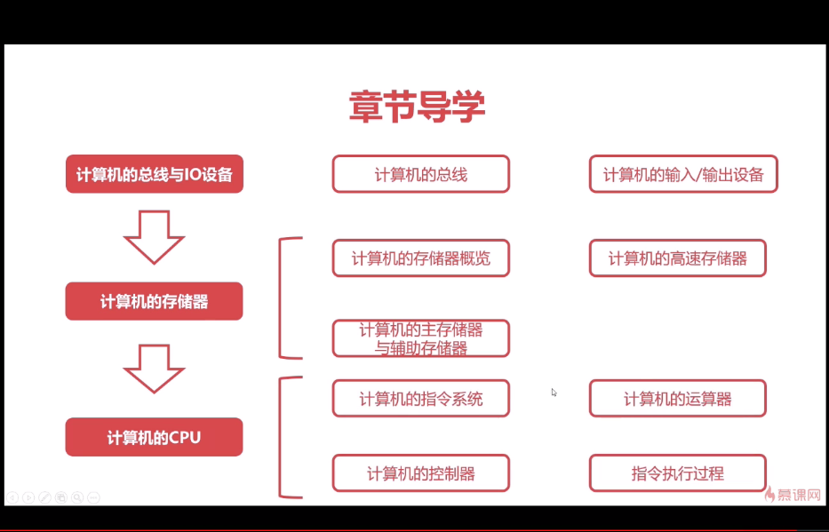

### 计算机的总线

#### 总线的概述

USB：通用串行总线

为了解决不同设备之间的通讯问题所制造的。

#### 总线的分类

##### 片内总线（高集成度芯片内部的信息传输线）

- 芯片内部的总线
- 寄存器与寄存器之间
- 寄存器与控制器、运算器之间的

    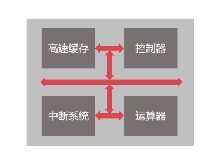

##### 系统总线

- 数据总线
  1. 双向传输各个部件的数据信息
  2. 数据总线的位数（总线宽度）是数据总线的重要参数
  3. 一般与CPU的位数相同
- 地址总线
  1. 指定源数据或目的数据在内存中的地址
  2. 地址总线的位数与储存单元有关
  3. **地址总线的位数是n,寻址范围：0~2n**
- 控制总线
  1. 控制总线是用来发出各种控制信号的传输线
  2. 控制信号经控制总线从一个组态发给另一个组态
  3. 控制总线可以监视不同组态之间的状态

#### 总线的仲裁

##### 为何需要总线的仲裁？

为了解决总线使用权的冲突问题

##### 总线仲裁方法

#####   链式查询

- 好处：电路的复杂度低，仲裁的方法简单
- 坏处：优先级低的设备难以获取总线的使用权

    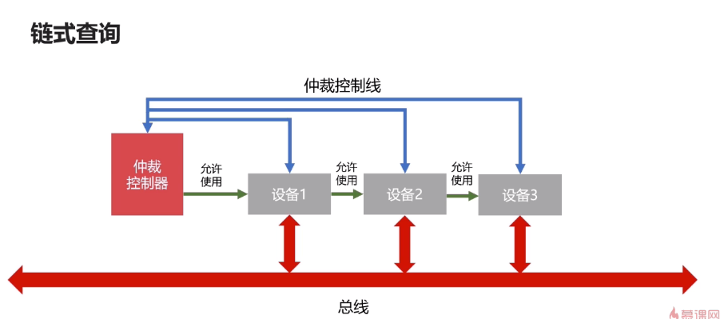

##### 计时器定时查询

- 仲裁控制器对设备编号并使用计数器累计计数
- 接受到仲裁信号后，往所有的设备中发出计数值
- 计数值与设备比编号一致则获取总线的使用权

    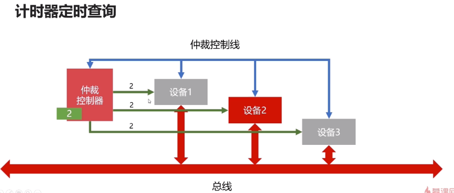

##### 独立请求

- 好处：响应速度快，优先顺序可以动态的变化
- 坏处：设备连接多，总线控制复杂

    

### 计算机的输入输出设备

#### 输入输出接口的通用设计

##### 数据线

- 是I/O设备与主机之间进行数据交换的传送线
- 单向传输数据线
- 双向传输数据线

##### 状态线

- IO设备状态向主机本报告的信号线
- 查询设备是否已经正常连接并就绪
- 查询设备是否被占用

##### 命令线

- CPU向设备发送命令的信号线
- 发送读写信号
- 发送启动停止信号

##### 设备选择线

- 主机选择I/O设备进行操作的信号线
- 对连接在总线上的设备进行选择

#### CPU与IO设备的通信

##### 程序中断

1. 当外围的IO设备就绪的时候，向CPU发出中断信号
2. CPU有专门的电路响应中断信号

##### DMA（直接存储器访问的方法）

#### 	计算机存储器

##### 存储器的分类

    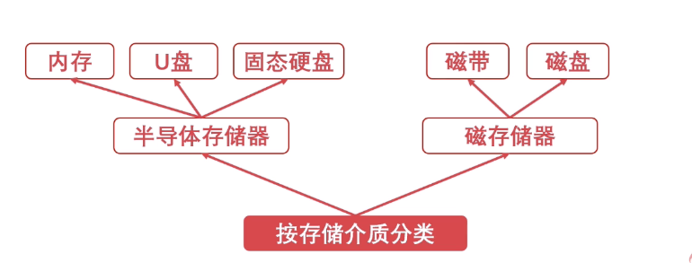

****

    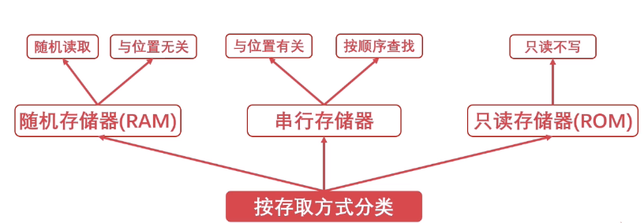

##### 存储器的层次结构

    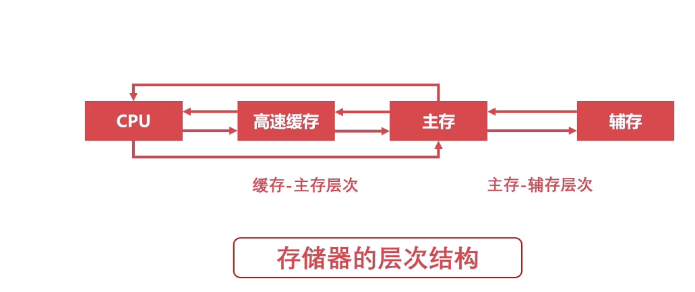

###### 缓存-主存层次

- **原理：**局部性原理
- **实现：**在CPU与主从之间增加一层速度快（容量小）的Cache
- **目的:**解决主存速度不足的问题

###### 主从-辅存层次

- **原理：**局部性原理
- **实现：**主存之外增加辅助存储器
- **目的：解决主存容量不足的问题**

###### 局部性原则

局部性是指CPU访问存储器时，无论是存取指令还是存取数据，所访问的存储单元都 **趋于聚集在一小快较小的连续区域里。**

#### 计算机的主存储器与辅助存储器

##### 主存储器-内存

**为什么断电以后内存中的东西会丢失？**

- RAM(随机存取存储器)

- 内存是通过电容来存储数据的，每隔一段时间都要对其刷新一次，进行数据的更新。
- 如果掉电，一段时间后就会丢失全部数据。

****

##### 内存结构

    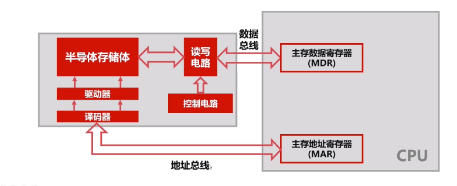

##### 辅助存储器-磁盘

###### 磁盘结构

    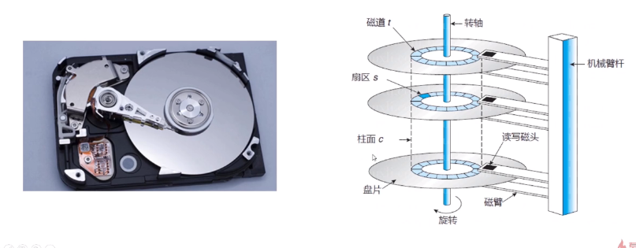

###### 磁盘的调度算法

- 先来先服务算法
- 最短寻道算法
- 扫描算法
- 循环扫描算法

#### 计算机的高速缓存

###### 高速缓存的工作原理

**概念**

**字：**是指存放在一个存储单元的二进制代码组合

**字块：**存储在连续的存储单元中而被看作是一个单元的一组字。

**示意图**

    

 **运算关系**

    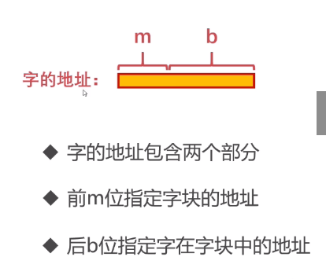

    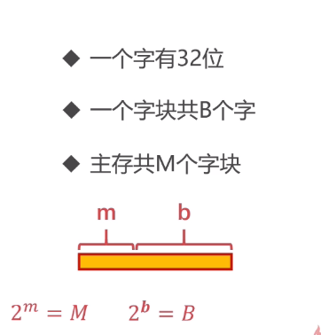

**命中率**

- 命中率是衡量缓存的重要性能指标
- 理论上CPU每次都能从高速缓存存取数据的时候，命中率是1

    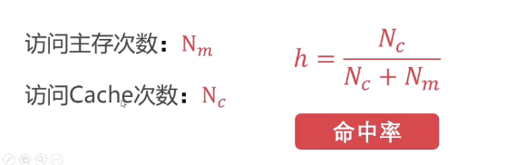

###### 高速缓存的替换策略

- 随机算法
- 先进先出算法（FIFO）

    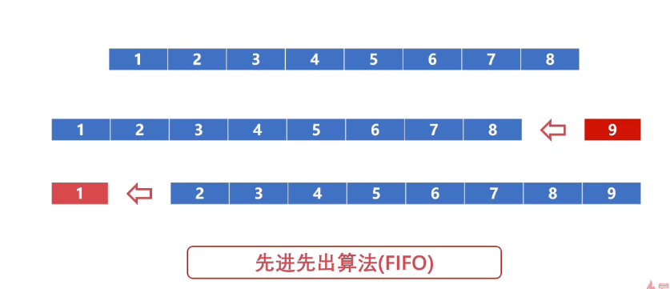

- 最不经常使用算法（LFU）

    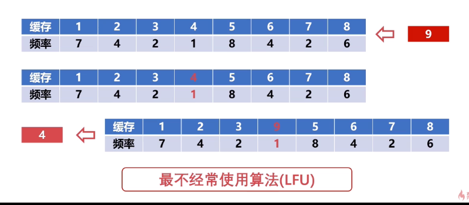

- 最近最少使用算法（LRU）

  1.   优先淘汰一段时间内没有使用的字块
  2. 一般使用双向链表实现
  3. 当前访问的节点置于链表的前面

  

      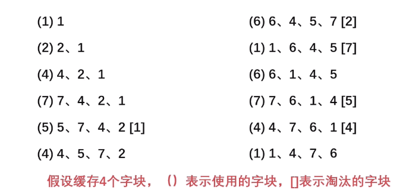
  

#### 计算机的指令系统

####  计算机的控制器

##### 结构

 

    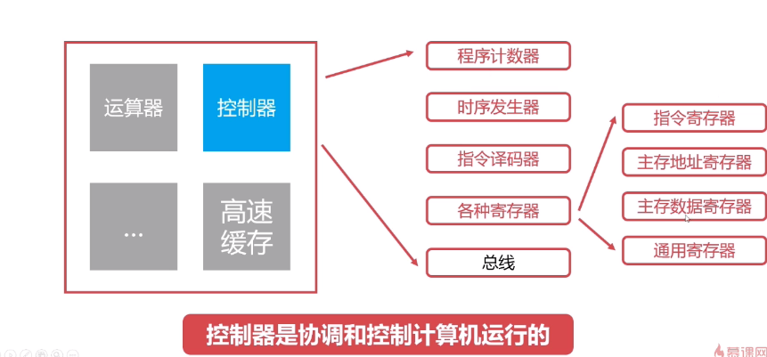

#####   程序计数器

- 程序计数器用来下一条指令的地址
- 循环从程序计数器中拿到指令
- 当指令被拿出来时，指向下一条指令

##### 时序发生器

- 电器工程领域，用于发送时序脉冲
- CPU依托不同的时序脉冲有节奏的工作

##### 指令译码器

#### 运算器

    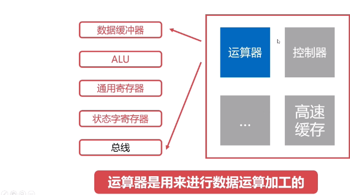

    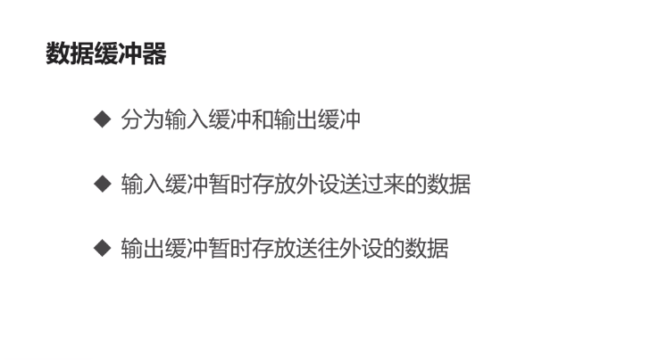

    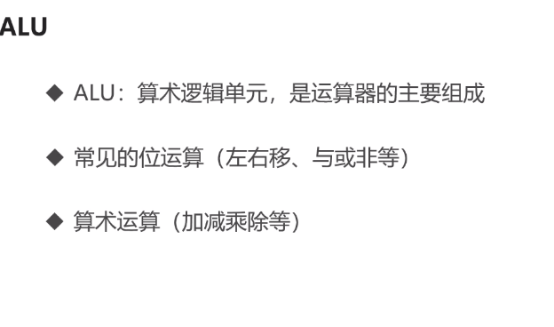

    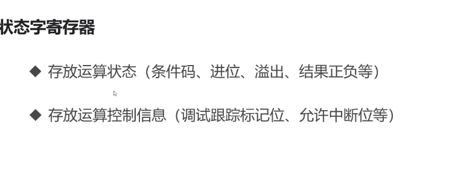

    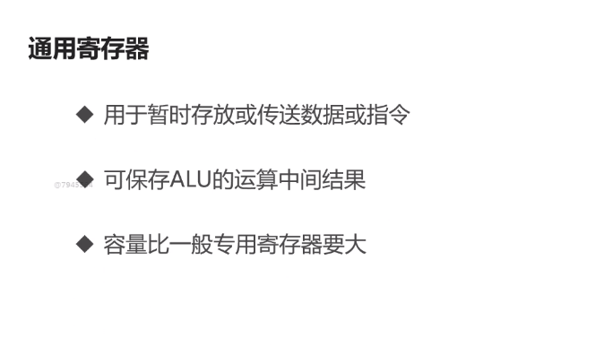

 