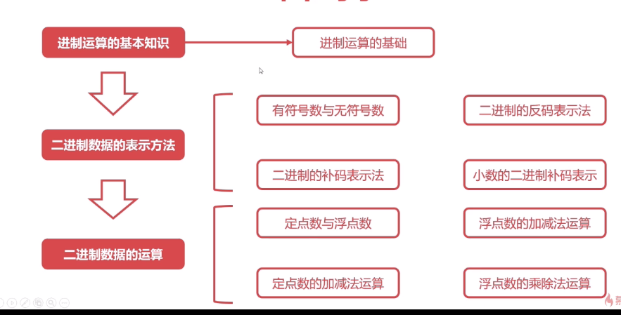
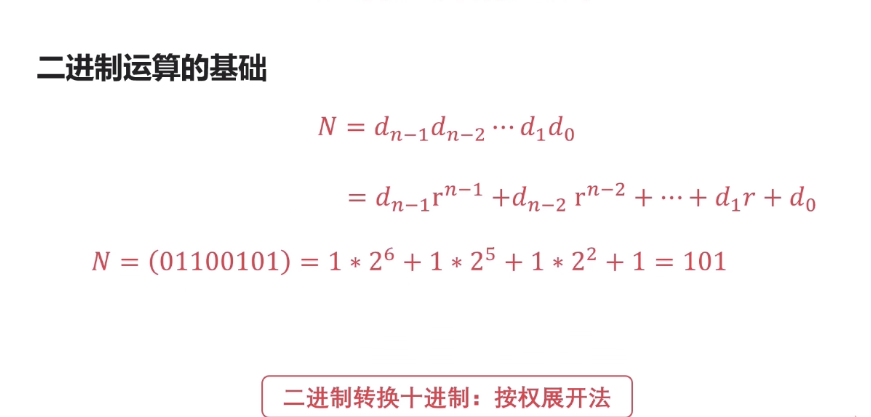
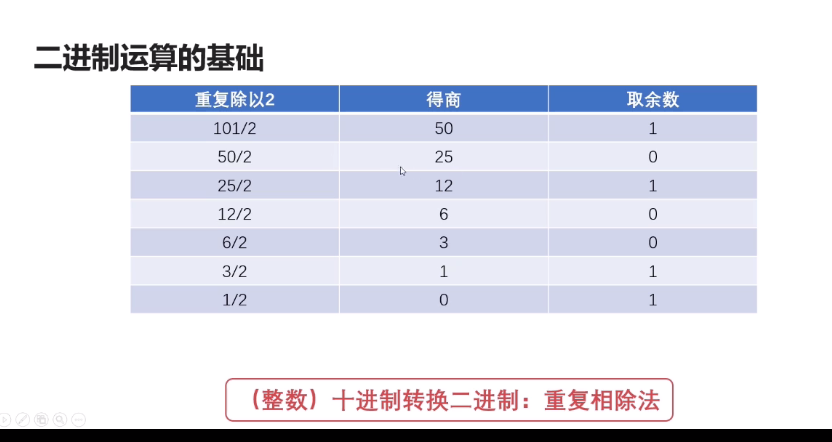
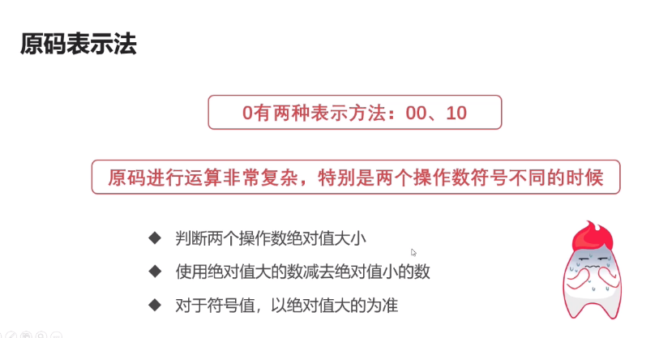
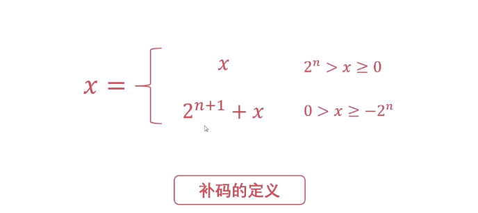
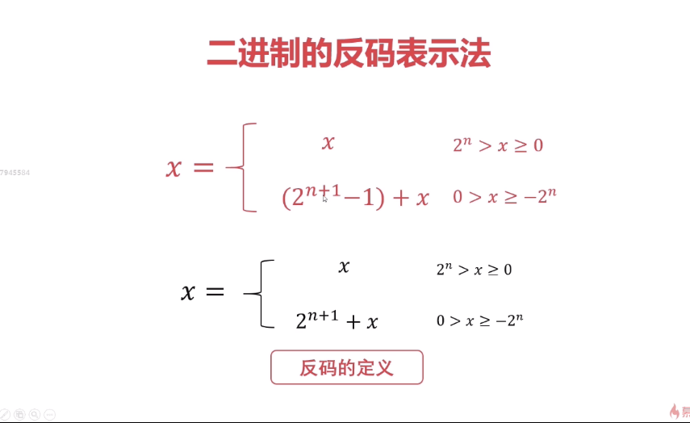
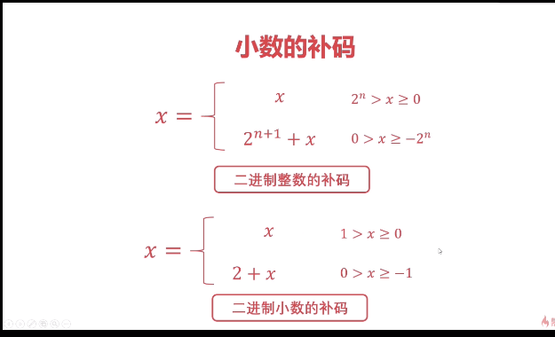

### 概述

    

### 进制运算的基础

#### 进制的概述

-   机制是一种计数的方式，亦称 进位计数法或为位值计数法。
- 有限种数字符号来表示无限的数值
- 使用数值符号的数目称为这种进制的基数或底数

#### 二进制运算的基础

##### 二进制转化为十进制：按权展开法

    

##### 十进制转化为二进制：重复相除法

    

#### 有符号数与无符号数

原码表示法

- 使用0表示正数，使用1来表示负数。

- 规定符号位位于数值第一位

- 表达简单明了，是人类最容易理解的表示法

  ##### 原码表示法的缺陷

  

      
  

   

#### 二进制补码表示法

#####  运算规则

    

##### 引入补码的目的

- 减法运算复杂，希望找到使用正数替代负数的方法
- 使用加法替代减法，从而消除减法

##### 二进制的反码表示法

运算规则

    

  

原码、反码、补码之间的关系

- 负数的反码等于原码除符号位外按位取反
- 补码的值等于反码的基础上加一

#### 小数的补码

    

####  定点数与浮点数

##### 定点数的表示方法

##### 浮点数的表示方法

###### 	浮点数的表示形式

​	任何的浮点数都可以表示为

