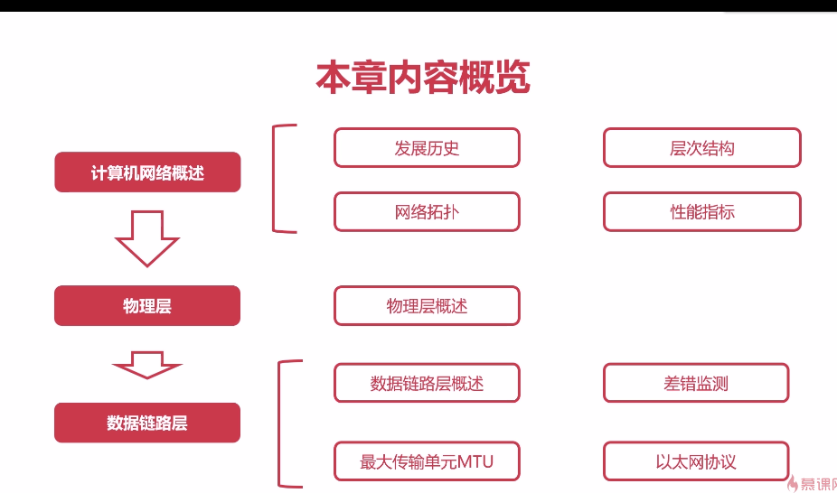

### 概述

 
    

### 计算机网络的发展历史

- 互联网的发展历史
- 中国互联网的发展历史

### 计算机网络的层次结构

#### 层次结构设计的基本原则

    

#### IOS七层协议

    

#### TCP/IP的四层协议

    

    

#### 现代互联网的网络拓扑

- ##### 边缘部分

  

      
  

- ##### 核心部分

    

 

- ##### 树状结构

    

 

#### 常用的模式

（C/S）模式

（P2P）模式

### 计算机的性能指标

 **时延：**发送时延、排队时延、传播时延、处理时延

**往返时间RTT**

-  RTT是评估网络质量的一项重要指标
- RTT表示的是数据报文在端与端通信中的来回一次的时间
- 通常使用ping命令来查看RTT

###  物理层概述

##### 物理层的作用

- 连接不同的物理设备
- 传输比特流

##### 信道的基本概念

- 信道是往一个方向传送信息的媒体
- 一个通信信道包含一个接受信道和一个发送信道

##### 信道的分类

- 单工通信信道

  ​	只能一个方向通信

- 半双工通信信道

  ​	双方都可以发送和接受信息

  ​	不能同时的发送，也不能同时的接收

- 全双工通信信道

  ##### 分用-复用技术

    		

  

      
  
 

#### 数据链路层的概述

##### 封装成帧

1. “帧”是数据链路层数据的基本单位
2. 发送端在网络层的一段数据前后添加特定的标记形成帧。
3. 接受端根据前后的特定标记识别出“帧”

##### 透明传输

控制字符在帧数据中，但是也要当作不存在的     去处理

**处理方法：**在数据包中的控制字符前面加上转义字符

##### 差错检测

###### 奇偶校验码

  有一定的局限

###### 循环冗余检验码CRC

    

 

- CRC的错误检测能力与位串的阶数r有关系
-  数据链路层只进行数据的检测，不进行纠错，如果数据出现错误，直接丢弃。

##### 最大传输单元MTU

- 最大传输单元MTU（Maximum Transmission Unit）
- 数据链路层的数据帧也不是无限大的
- 数据帧过大或过小都会影响传输效率
- 以太网MTU一般是1500字节 
- 路径  MTU由链路层中的最小值决定

