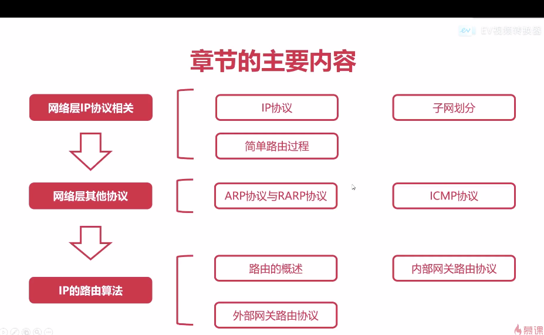
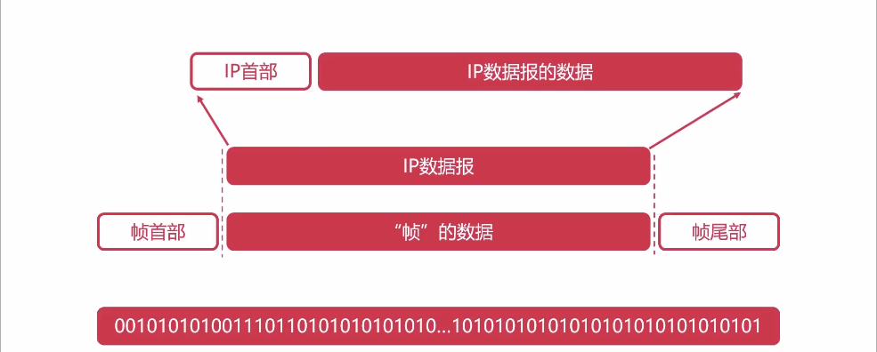
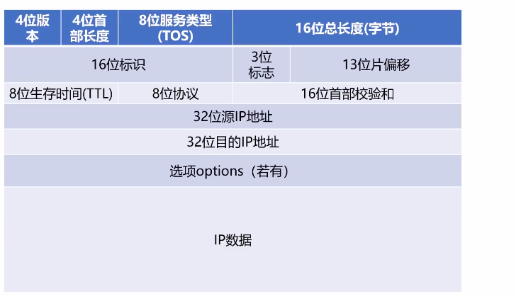

#### 概述

网路层：数据路由(决定数据在网络中的路径)

    

 

#### IP协议详解

##### 虚拟互联网络

##### IP网络

MAC地址：是计算机网卡的唯一标识。

- 唯一的，不可改变的。

IP地址：网络设备的唯一标识。

- 根据网络环境，是可以改变的。
- ip地址长度位32位，常分为4个8位
- IP地址常用点分十进制来表示。（0~255.0，0~255.0,  0~255.0, 0~255.0）
- 最多可以表示，232个地址

    

 

###### ip地址的首部

    
    
 

**四位版本**

#### 路由表的简介

####   IP协议的转发流程

从 